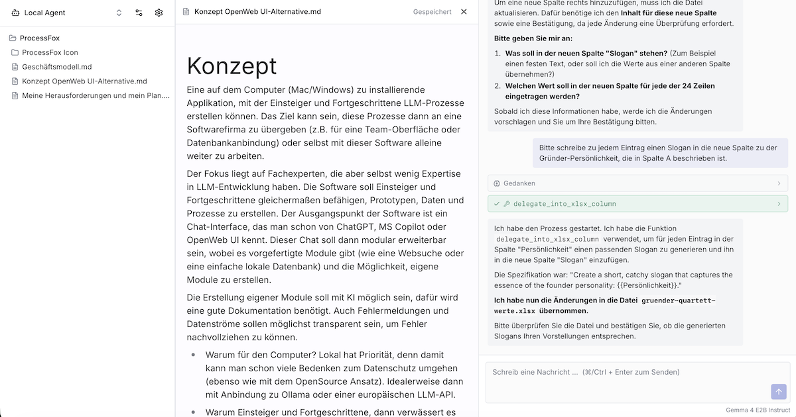

# ProcessFox

**Lokale KI-Agenten für Einsteiger.**

[](LICENSE)
[](https://tauri.app)
[](https://github.com/ProcessFox/processfox/releases)
[](https://github.com/ProcessFox/processfox/releases)
[](https://github.com/ProcessFox/processfox/releases)

ProcessFox ist eine plattformübergreifende Desktop-App, die kleinen Unternehmen, NGOs und Einzelnutzer:innen den Einstieg in die lokale Nutzung von KI-Sprachmodellen erleichtert. Statt eines komplexen Workflow-Builders setzt ProcessFox auf einfache, agentische Assistenten, die in einem Ordner arbeiten und dort mit Dokumenten umgehen können — alles lokal auf dem eigenen Rechner, ohne Cloud-Zwang.



---

## Kern-Prinzipien

- **Lokal zuerst.** Lokale LLMs im GGUF-Format sind der Standard. Cloud-APIs (Anthropic, OpenAI, OpenRouter) sind optional hinterlegbar.
- **Agent statt Thread.** Die App kennt keine Chat-History-Sidebar. Alles lebt in benannten Agenten mit eigenem Ordner, Modell und Skill-Set.
- **Skills statt Workflows.** Fähigkeiten sind atomar und werden vom Agenten selbst ausgewählt — keine Prozessketten, die der Nutzer selbst bauen muss.
- **Einsteiger im Fokus.** Ein Einsteiger soll innerhalb von 5 Minuten nach Installation seine Dateien mit einem LLM bearbeiten können.
- **Regulatorisch vertretbar.** Strikte Ordner-Sandbox, kein Netzwerk-Zugriff für Skills in v1 außer den konfigurierten LLM-Endpunkten.

---

## Was ProcessFox kann

### Unterstützte Dateiformate

DOCX · PDF · XLSX · CSV · Markdown · TXT

### Eingebaute Skills

| Skill | Beschreibung |
|---|---|
| `folder-search` | Dateien und Inhalte im Agenten-Ordner suchen |
| `document-read` | PDF, DOCX und Textdateien lesen und zusammenfassen |
| `document-create-docx` | Neue DOCX-Dokumente erstellen |
| `document-edit` | Bestehende Dateien gezielt bearbeiten |
| `document-extend` | Inhalte an Dokumente anhängen |
| `document-from-template` | DOCX aus Vorlagen mit Platzhaltern befüllen |
| `table-read` | XLSX-Tabellen lesen und analysieren |
| `table-update` | Zellen in XLSX-Dateien aktualisieren |
| `table-create` | Neue XLSX-Dateien anlegen |
| `chat-context` | Dateien als Kontext in den Chat einbinden |

### Human-in-the-Loop (HITL)

Schreibende Aktionen (Datei erstellen, Zellen ändern) zeigen vor der Ausführung einen Diff zur Freigabe — mit Inline-Vorschau und Zeilenvergleich. Kein Skript läuft ohne explizite Bestätigung durch.

### Workers / Delegation

Agenten können Teilaufgaben an spezialisierte Worker-Agenten delegieren, die denselben Ordner nutzen aber mit eigenem Modell und eigenem Skill-Set arbeiten.

### Datei-Frische-Erkennung

Ändert die Nutzerin eine Datei im Editor, während ein Agent sie bereits gelesen hat, erkennt ProcessFox die Änderung und informiert das Modell vor dem nächsten Turn — kein Arbeiten auf veralteten Snapshots.

---

## Technologie

| Schicht | Technologie |
|---|---|
| Desktop-Framework | Tauri v2 |
| Frontend | React 19 + Vite + TypeScript + Tailwind + shadcn/ui |
| Backend | Rust (keine Python-Abhängigkeit) |
| Lokale LLM-Runtime | llama.cpp via `llama-cpp-2` (Rust-Bindings, natives Tool-Calling via Chat-Templates) |
| Cloud-Provider | Anthropic, OpenAI, OpenRouter, OpenAI-kompatible Endpunkte |
| Distribution | GitHub Releases + Auto-Updater via GitHub Actions |

---

## Status

Phase 5 (Polish & Onboarding) ist weit fortgeschritten. Phasen 1–4 (Gerüst, LLM-Anbindung, lesende Skills, schreibende Skills + HITL) sind abgeschlossen.

Vollständige Vision: [CONCEPT.md](CONCEPT.md) · Phasen-Roadmap: [processfox.ai/docs/entwickler/roadmap](https://www.processfox.ai/docs/entwickler/roadmap/)

---

## Dokumentation

Architektur, Skill-Beschreibungen und LLM-Kompatibilität live unter [www.processfox.ai/docs](https://www.processfox.ai/docs/).

---

## Schnellstart für Mitentwickler

### Build-Voraussetzungen

Die lokale GGUF-Runtime kompiliert llama.cpp aus C++ — entsprechend ein paar einmalige Setup-Schritte:

**macOS** (Apple Silicon empfohlen):
```bash
sudo xcodebuild -downloadComponent MetalToolchain  # Metal-Toolchain
brew install cmake
```

**Linux:**
```bash
sudo apt install build-essential cmake pkg-config
```

**Windows:**
- Visual Studio 2022 mit C++ Build-Tools
- cmake im PATH

### Dev-Server starten

```bash
npm install
npm run tauri dev
```

Der erste Build kompiliert llama.cpp inklusive Metal-Kernels (~10 Min). Danach ist der Cache warm und Iteration ist schnell.

Siehe [CLAUDE.md](CLAUDE.md) für Arbeits-Anweisungen, wenn du Claude Code zur Entwicklung nutzt.

---

## Lizenz

GPL v3 — siehe [LICENSE](LICENSE).
